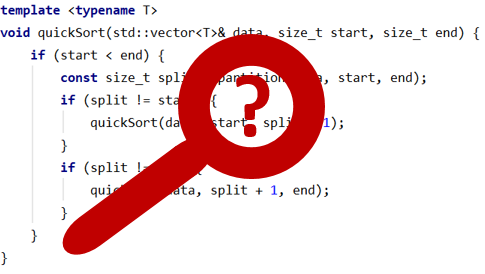

# Welcome to Principles of Static Program Analysis

This site contains materials for the "Principles of Static Program Analysis" course taught at
[Faculty of Computer Science of Higher School of Economics](https://cs.hse.ru/en/).

For information on course administration, please refer to the
__[official course page](http://wiki.cs.hse.ru/SPA_2022)__ at the university website.
Also, here is the link to the __[official syllabus](https://www.hse.ru/edu/courses/749544907)__.

## Course Motivation

__Static analysis__ is a method that allows developers to ensure code quality without running it.
Modern software companies use a variety of static analysis tools and even create their solutions
to cover specific requirements. 
The goal of the course to give students an introduction into methods of static analysis.
The lectures give the necessary theoretical background.
The workshops will give experience with modern static
analysis tools and frameworks used to create them. 
The course will be useful for those who are interested to:
better understand programming languages and compilers;
create own domain-specific languages;
efficiently use static analysis tools;
create own static analysis tools.

## Course Description

The course is taught in __modules 1-2__.
The course contains __15 lectures__ and __15 workshops__.

## Course Topics

1.  [Introduction to static analysis.](lectures/01/index.md)
2.  [Lexical analysis.](lectures/02/index.md)
3.  [Syntax analysis.](lectures/03/index.md)
4.  [Syntax analysis.](lectures/04/index.md)
5.  [Internal representation.](lectures/05/index.md)
6.  [Abstract syntax tree analysis.](lectures/06/index.md)
7.  [Control-flow analysis.](lectures/07/index.md)
8.  [Data-flow analysis.](lectures/08/index.md)
9.  [Inter-procedural analysis.](lectures/09/index.md)
10. [Symbolic execution and SMT solvers.](lectures/10/index.md)
11. [Deductive verification.](lectures/11/index.md)
12. [Mining-based analysis.](lectures/12/index.md)
13. [Case Study: JVM and Java bytecode analysis.](lectures/13/index.md)
14. [Case Study: LLVM and Clang Static Analyzer.](lectures/14/index.md)
15. [Case Study: EOLANG and Polystat.](lectures/15/index.md)

## Grading System

Information on the grading system for the course is [here](grades.md).

## Textbooks and Related Courses

The list of textbooks and related courses recommended for studying is [here](books.md).

## Links

Links to other related external resources are [here](links.md).

## Feedback

If you have any questions or suggestions related to the course content, please feel free to submit
an [issue](https://github.com/andrewt0301/static-analysis-course/issues)
or contact the course [author](https://github.com/andrewt0301).
If you like the course, you are welcome to star it in
[GitHub](https://github.com/andrewt0301/static-analysis-course).
